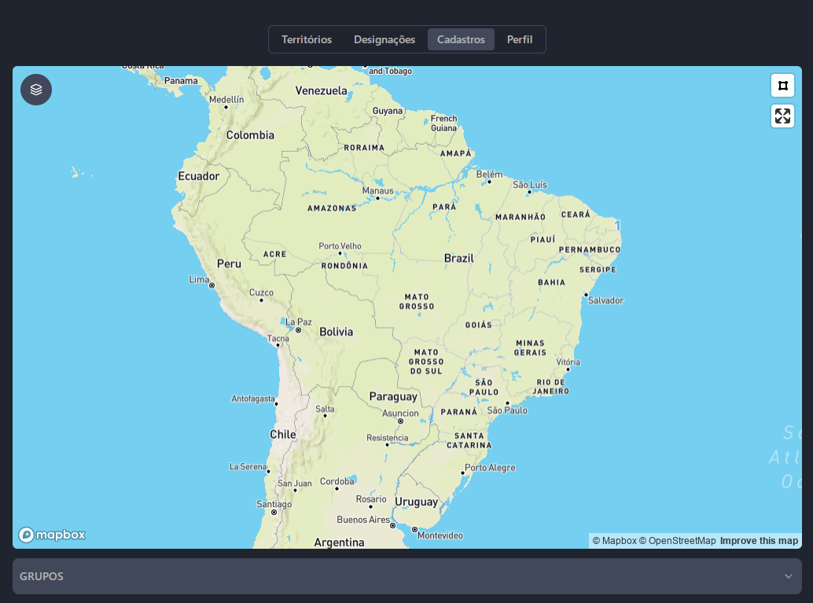
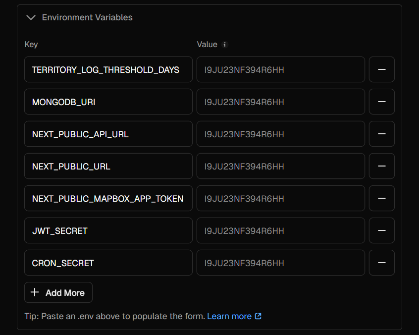

# Territory Manager 🗺️



O **_Territory Manager_** é uma ferramenta desenvolvida para facilitar a organização e administração dos territórios ministeriais das Testemunhas de Jeová. Seu principal objetivo é permitir o gerenciamento eficiente desses territórios, garantindo que cada área seja atribuída e acompanhada corretamente.

A plataforma permite que os usuários realizem diversas operações essenciais, como:

- **Cadastro de Territórios:** Registre novas áreas de pregação, atribuindo a cada uma um número único e outras informações relevantes.
- **Gerenciamento de Quadras:** Dentro de cada território, é possível cadastrar quadras específicas, ajudando na segmentação e organização das visitas.
- **Registro de Bairros:** Para um controle mais detalhado, o sistema permite cadastrar bairros aos quais os territórios pertencem.
- **Grupos de Serviço:** Os territórios podem ser atribuídos a diferentes grupos de serviço, facilitando a distribuição e o acompanhamento das atividades de cada equipe.
- **Atribuição de Responsáveis:** Permite associar um ou mais responsáveis a cada território, garantindo um melhor acompanhamento do andamento das visitas.

Com essa ferramenta, a organização dos territórios torna-se mais simples e acessível, ajudando os responsáveis a manter um controle mais eficiente das atividades de pregação.

## Tecnologias utilizadas

Para o desenvolvimento do Territory Manager, optei por utilizar tecnologias modernas que facilitam a adição de novas funcionalidades e permitem que outros usuários clonem e adaptem o projeto conforme suas necessidades.

As principais tecnologias utilizadas são:

- **Next.js** – Framework React que oferece alta performance e otimizações automáticas.
- **Tailwind CSS** – Biblioteca de estilização utilitária para um design responsivo e eficiente.
- **MongoDB** – Banco de dados NoSQL escalável e flexível para armazenar as informações. (Possui um plano gratuito)
- **ShadCN/UI** – Componentes acessíveis e estilizados, garantindo uma ótima experiência do usuário.
- **Mapbox GL JS** – Biblioteca para renderização e manipulação de mapas interativos.

## Como Clonar o Repositório e Configurar o Projeto

### Clonando o Repositório

Para utilizar este projeto, siga os passos abaixo:

1. **Abra o terminal** e navegue até o diretório onde deseja clonar o repositório.
2. **Clone o repositório** executando o comando:
   ```sh
   git clone https://github.com/JonathanPR0/territorymanager.git
   ```
3. **Entre no diretório do projeto**:
   ```sh
   cd territorymanager
   ```
4. **Instale as dependências**:
   ```sh
   npm install
   ```

### Mantendo o Projeto Atualizado (Opcional)

Se quiser manter o projeto sempre atualizado com a versão principal, você pode adicionar um remote upstream:

1. **Adicione o repositório original como upstream**:
   ```sh
   git remote add upstream https://github.com/JonathanPR0/territorymanager
   ```
2. **Sempre que desejar atualizar o seu fork**:
   ```sh
   git fetch upstream
   git merge upstream/main
   ```

### Obtendo a URL do MongoDB

Para utilizar o banco de dados MongoDB, siga os passos:

1. Acesse [MongoDB Atlas](https://www.mongodb.com/atlas)
2. Faça login ou crie uma conta
3. Crie um novo cluster (caso não tenha)
4. No painel do cluster, clique em "Connect" > "Connect your application"
5. Copie a **MongoDB Connection String** e substitua no arquivo `.env` do projeto:
   ```env
   MONGODB_URI=mongodb+srv://<user.db>:<password.db>@<database.name>/?retryWrites=true&w=majority&appName=<app.name>
   ```

**Obs.:** Substitua os campos com <> pelos valores reais (removendo o <>)

### Cadastrando-se no Mapbox GL

Para utilizar o Mapbox GL, siga os passos:

1. Acesse [Mapbox](https://www.mapbox.com/)
2. Crie uma conta ou faça login
3. Vá até **Account > Tokens** e gere um novo token de acesso
4. No arquivo `.env` do projeto, adicione:
   ```env
   NEXT_PUBLIC_MAPBOX_ACCESS_TOKEN=<SEU_TOKEN>
   ```

### Todas a variáveis de ambiente



As variáveis de ambiente acima são essenciais para o funcionamento seguro e eficiente da aplicação. Abaixo está a descrição de cada uma:

- **TERRITORY_LOG_THRESHOLD_DAYS**: Define o número de dias antes de um log de território ser considerado obsoleto ou precisar de uma ação.
- **MONGODB_URI**: Contém a string de conexão ao banco de dados MongoDB, essencial para a persistência de dados da aplicação.
- **NEXT_PUBLIC_API_URL**: URL da API pública utilizada pela aplicação Next.js. Como é uma variável pública (`NEXT_PUBLIC`), pode ser acessada no lado do cliente.
- **NEXT_PUBLIC_URL**: Define a URL pública da aplicação Next.js, usada para construir links e chamadas internas.
- **NEXT_PUBLIC_MAPBOX_APP_TOKEN**: Token de acesso à API do Mapbox, utilizado para renderização de mapas na aplicação.
- **JWT_SECRET**: Chave secreta utilizada para assinar e validar tokens JWT, garantindo a segurança na autenticação e comunicação.
- **CRON_SECRET**: Chave utilizada para autenticar requisições a jobs agendados (CRON), garantindo que apenas chamadas autorizadas possam executar essas tarefas.

**Obs.:** Os valores das variáveis são sensíveis e devem ser mantidos em segurança. É recomendável criar um aquivo `.env.local` e armazenar nele. No projeto há um arquivo `.example.env.local` com um exemplo de cada variável de ambiente.

---

Caso tenha dúvidas ou precise de ajuda, sinta-se à vontade para entrar em contato comigo, no meu portifólio você pode encontrar um campo para me enviar um e-mail. Tentarei responder o quanto antes!

**Portifolio:** <a href="https://jonportfolio.vercel.app/">https://jonportfolio.vercel.app/</a>
